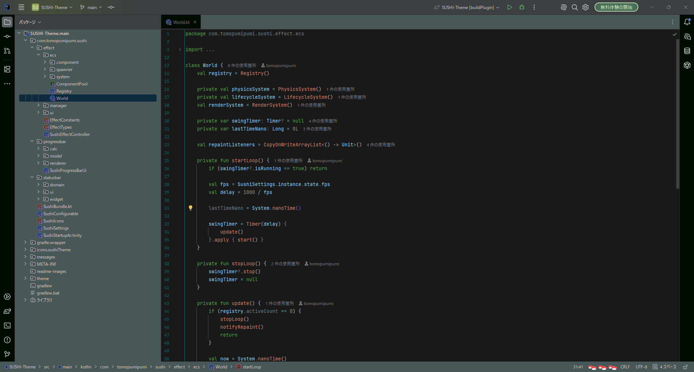
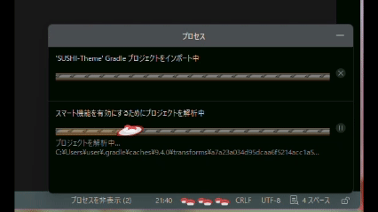
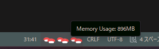
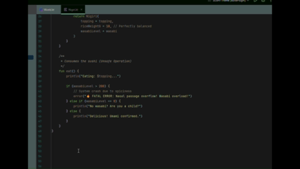
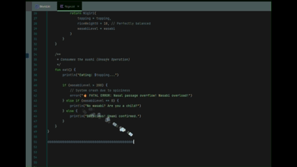

  <h1>🍣 SUSHI-Theme</h1>
  
<b>Welcome to the best Sushi restaurant in your IDE.</b>

  <blockquote style="background: #fff3cd; color: #856404; padding: 10px; border-left: 5px solid #ffeeba; display: inline-block;">
    ⚠️ <b>Warning:</b> May cause sudden cravings for sushi.
  </blockquote>
    
  

  

<h2>🍣 Fresh Features</h2>

<table style="width: 100%; border: none; border-collapse: collapse;">
  <tr>
    <td style="width: 55%; text-align: center; padding: 20px; vertical-align: middle;">
      
    </td>
    <td style="width: 45%; padding: 20px; vertical-align: middle;">
      <h3>🚄 Conveyor Belt Progress Bar</h3>
      
Say goodbye to boring loading bars! Whenever your IDE is processing tasks, a delicious rotating sushi conveyor belt will appear.

      
Watch the plates flow by as your builds and indexes complete.

    </td>
  </tr>

  <tr>
    <td style="width: 45%; padding: 20px; vertical-align: middle;">
      <h3>🍣 SUSHI Memory Indicator</h3>
      
Check your IDE memory usage easily right in your status bar.

      
Low memory = A few pieces of sushi. 
      High memory = A full plate of sushi!

      
Click the indicator to pop up detailed System Memory stats (Used, Committed, Max).

    </td>
    <td style="width: 55%; text-align: center; padding: 20px; vertical-align: middle;">
      
    </td>
  </tr>

  <tr>
    <td style="width: 55%; text-align: center; padding: 20px; vertical-align: middle;">
      
    </td>
    <td style="width: 45%; padding: 20px; vertical-align: middle;">
      <h3>🥢 Omakase Typing Effects</h3>
      
Every keystroke drops a burst of sushi! Enjoy a smooth... Enjoy a smooth, zero-lag experience powered by our custom high-performance ECS engine.

      
Build your combo to upgrade your sushi. Choose your favorite topping: <b>Maguro, Ikura, Ebi, Matcha</b>, or let the chef decide with <b>Random</b> mode.

    </td>
  </tr>

  <tr>
    <td style="width: 45%; padding: 20px; vertical-align: middle;">
      <h3>🔥 FEVER TIME!</h3>
      
Type fast and don't break your combo! Hit the target (default: 50) to trigger <b>FEVER MODE</b>.

      
Enjoy a shower of golden glowing sushi, active line highlights, and a blazing status bar animation to keep your coding momentum going!

    </td>
    <td style="width: 55%; text-align: center; padding: 20px; vertical-align: middle;">
      
    </td>
  </tr>
</table>

  

<h2>⚙️ Custom Orders (Settings)</h2>

You can customize your sushi experience from the IDE settings (<code>Settings/Preferences</code> &rarr; <code>Appearance & Behavior</code> &rarr; <code>Sushi Theme</code>).

<table style="width: 100%; min-width: 100%; display: table; table-layout: fixed; border-collapse: collapse; text-align: left; border: 1px solid #ddd;">
  <thead style="background-color: #f8f9fa;">
    <tr>
      <th style="width:25%; padding: 12px; border-bottom: 2px solid #ddd;">Setting Name</th>
      <th style="width:15%; padding: 12px; border-bottom: 2px solid #ddd; text-align: center;">Default</th>
      <th style="width:70%; padding: 12px; border-bottom: 2px solid #ddd;">Description</th>
    </tr>
  </thead>
  <tbody>
    <tr>
      <td style="padding: 10px; border-bottom: 1px solid #ddd;"><code>Enable Progress Bar</code></td>
      <td style="padding: 10px; border-bottom: 1px solid #ddd; text-align: center;"><code>true</code></td>
      <td style="padding: 10px; border-bottom: 1px solid #ddd;">Show the sushi conveyor belt progress bar.  <i>*Requires IDE restart</i></td>
    </tr>
    <tr>
      <td style="padding: 10px; border-bottom: 1px solid #ddd;"><code>Enable Status Bar</code></td>
      <td style="padding: 10px; border-bottom: 1px solid #ddd; text-align: center;"><code>true</code></td>
      <td style="padding: 10px; border-bottom: 1px solid #ddd;">Show StatusBar (Sushi memory indicator)</td>
    </tr>
    <tr>
      <td style="padding: 10px; border-bottom: 1px solid #ddd;"><code>Effect Type</code></td>
      <td style="padding: 10px; border-bottom: 1px solid #ddd; text-align: center;"><code>random</code></td>
      <td style="padding: 10px; border-bottom: 1px solid #ddd;">Select the flying sushi effect on typing. (Default: Random) <i>Options: maguro, ikura, ebi, matcha, random, none</i></td>
    </tr>
    <tr>
      <td style="padding: 10px; border-bottom: 1px solid #ddd;"><code>Particle Speed Multiplier</code></td>
      <td style="padding: 10px; border-bottom: 1px solid #ddd; text-align: center;"><code>1.3</code></td>
      <td style="padding: 10px; border-bottom: 1px solid #ddd;">Speed multiplier for flying sushi (Default: 1.3. Example: 1.3 is 1.3x speed).</td>
    </tr>
    <tr>
      <td style="padding: 10px; border-bottom: 1px solid #ddd;"><code>Bounce Top Distance</code></td>
      <td style="padding: 10px; border-bottom: 1px solid #ddd; text-align: center;"><code>200</code></td>
      <td style="padding: 10px; border-bottom: 1px solid #ddd;">Distance in pixels the sushi flies upward from the typing cursor before bouncing back (Set to 0 to disable bouncing).</td>
    </tr>
    <tr>
      <td style="padding: 10px; border-bottom: 1px solid #ddd;"><code>Combo Unit</code></td>
      <td style="padding: 10px; border-bottom: 1px solid #ddd; text-align: center;"><code>5</code></td>
      <td style="padding: 10px; border-bottom: 1px solid #ddd;">Keystrokes to upgrade sushi (Default: 5)</td>
    </tr>
    <tr>
      <td style="padding: 10px; border-bottom: 1px solid #ddd;"><code>Combo Timeout Ms</code></td>
      <td style="padding: 10px; border-bottom: 1px solid #ddd; text-align: center;"><code>1500</code></td>
      <td style="padding: 10px; border-bottom: 1px solid #ddd;">Time (in ms) before combo resets (Default: 1500)</td>
    </tr>
    <tr>
      <td style="padding: 10px; border-bottom: 1px solid #ddd;"><code>Fever Trigger Combo</code></td>
      <td style="padding: 10px; border-bottom: 1px solid #ddd; text-align: center;"><code>50</code></td>
      <td style="padding: 10px; border-bottom: 1px solid #ddd;">Number of combos to start Fever Time.</td>
    </tr>
    <tr>
      <td style="padding: 10px; border-bottom: 1px solid #ddd;"><code>Fever Duration Ms</code></td>
      <td style="padding: 10px; border-bottom: 1px solid #ddd; text-align: center;"><code>10000</code></td>
      <td style="padding: 10px; border-bottom: 1px solid #ddd;">How long Fever Time lasts in milliseconds (e.g., 10000 = 10 seconds).</td>
    </tr>
    <tr>
      <td style="padding: 10px; border-bottom: 1px solid #ddd;"><code>Fever Spawn Count</code></td>
      <td style="padding: 10px; border-bottom: 1px solid #ddd; text-align: center;"><code>5</code></td>
      <td style="padding: 10px; border-bottom: 1px solid #ddd;">Number of sushi dropped per keystroke in Fever Time.</td>
    </tr>
    <tr>
      <td style="padding: 10px; border-bottom: 1px solid #ddd;"><code>FPS (Frame Rate)</code></td>
      <td style="padding: 10px; border-bottom: 1px solid #ddd; text-align: center;"><code>30</code></td>
      <td style="padding: 10px; border-bottom: 1px solid #ddd;">Set the frame rate (draws per second) for effects. Higher values provide smoother animations but increase IDE load. <i>Options: 15, 30, 60, 120</i></td>
    </tr>
    <tr>
      <td style="padding: 10px; border-bottom: 1px solid #ddd;"><code>Throttle Ms</code></td>
      <td style="padding: 10px; border-bottom: 1px solid #ddd; text-align: center;"><code>80</code></td>
      <td style="padding: 10px; border-bottom: 1px solid #ddd;">Set the minimum time (in milliseconds) between effect renders. Increase this value if your IDE lags during continuous typing.</td>
    </tr>
  </tbody>
</table>

  

  
<i>Ready to order? Install now and enjoy your meal! 🍣✨</i>

